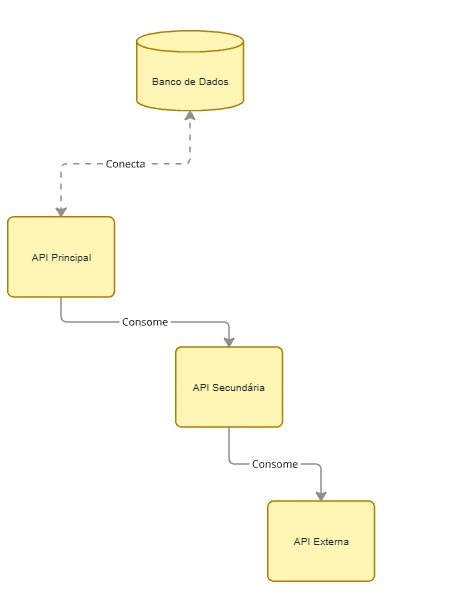

# MVP Desenvolvimento FullStack Avançado API principal

## Ganhadores
API para gerenciamento de ganhadores de nobel favoritos 

### Arrquitetura


### API Externa
O projeto utiliza uma API externa disponivél em:
[API Externa](https://app.swaggerhub.com/apis/NobelMedia/NobelMasterData/2.1#/)

A API é gratuita e não necessita de cadastro


## Execução sem docker

### Requisitos
É necessário a instalação do python e o pip para funcionamento da api

Python: https://www.python.org/downloads/

Após instalar o python em seu ambiente basta rodar o comando 
```
python -m ensurepip --upgrade
```

Navegue até a pasta src em um terminal e execute:
```
python -m pip install -r .\requirements.txt
```
Após a instalação dos pacotes com sucesso basta executar:
```
python -m flask run
```
ou para definir a porta execute:

```
python -m flask run --host=0.0.0.0 --port=5000
```

O banco SQLite tem suas tabelas inicializadas via código ao iniciar a API, não é necessária nenhuma ação

## Execução com docker

### Instalação Docker
#### Windows

[Docker Windows](https://docs.docker.com/desktop/setup/install/windows-install/)

#### Linux
[Docker Linux](https://docs.docker.com/desktop/setup/install/linux/)

#### MAC
[Docker Mac](https://docs.docker.com/desktop/setup/install/mac-install/)


### Como executar com  docker

Para construir a imagem execute o comando

```
docker build -t api-principal .
```

Para executar a imagem execute

```
docker run -p 5000:5000 --env-file .env api-principal
```
A porta padrão é 5000, caso deseje executar em outra porta edite o arquivo DockerFile e o comando de execução de acordo

### Informações adicionais

O projeto contém a documentação swagger disponível na url

http://localhost:5000/openapi/swagger

ou 

{sua_url}/openapi/swagger

Existe uma API secundária ao projeto disponível em [Desenvolvimento FullStack Avançado API Secundária](https://github.com/mebur56/Desenvolvimento_FullStack_Secundario_Avan-ado)
